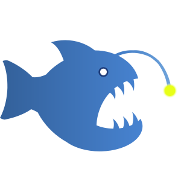

<div align="center">


<h1>Bait programming language</h1>

[![CI][ci-badge]][gh-actions]
[![Discord][discord-badge]][discord-invite]

</div>


## Introduction
This repository contains the compiler, cli, standard library and documentation for Bait.

```bait
fun main() {
    println('hello world')
}
```


## Key Features
> **Status:** Bait is in active development.
> It is stable for personal use,
> but please be prepared for possible breaking changes and evolving features (🚧).

- Consistent syntax balancing simplicity for newcomers with power for experienced developers
- Type and memory safety with immutability by default
- Explicit and predictable error handling using Result types
- JavaScript backend (NodeJS, 🚧 Web)
- 🚧 C backend
- Cross-platform support (Linux, 🚧 Windows)


## Documentation
> A dedicated website, comprehensive language documentation and a documentation generator are work in progress.<br>
> The language specification will be formalized and released during the beta phase.

The [Language Overview](docs/docs.md) provides a brief introduction to the syntax and features.


## Examples
Some basic example programs can be found in the [examples](examples) directory.

For a much larger list of examples, check out the [Rosetta Code solutions][rosetta].


## Installation
Right now Bait has to be compiled from source.
Precompiled binaries will be available in the future.


## Building from source
> Required dependencies: `git` and `NodeJS >= 18`

Linux:
```sh
git clone https://github.com/bait-lang/bait
cd bait
./make.sh
sudo ./bait symlink
```

Windows:
```powershell
git clone https://github.com/bait-lang/bait
cd bait
./make.bat

# In admin shell:
./bait.bat symlink
```

Now you should have Bait compiled to JS at `<repo>/bait.js`.

Thanks to the symlinked wrapper script,
you can use the compiler with a simple command like `bait run examples/hello_world.bt`.


### Upgrading to the latest version
To update Bait to the latest commit, run `bait up`.


## Contributing
Your contributions are always welcome and highly appreciated!
To get started, please take a look at [CONTRIBUTING.md](./CONTRIBUTING.md).


## Community
For progress updates, discussions and support, join the [official Discord server][discord-invite].


## License
Bait is provided under the [MIT License](./LICENSE.txt).


<!-- links -->
[ci-badge]: https://github.com/bait-lang/bait/actions/workflows/ci.yml/badge.svg?branch=main
[gh-actions]: https://github.com/bait-lang/bait/actions/workflows/ci.yml
[discord-badge]: https://img.shields.io/discord/1204569231992295494?label=Discord
[discord-invite]: https://discord.gg/sM8mspGMnf
[rosetta]: https://github.com/bait-lang/rosetta-bait
