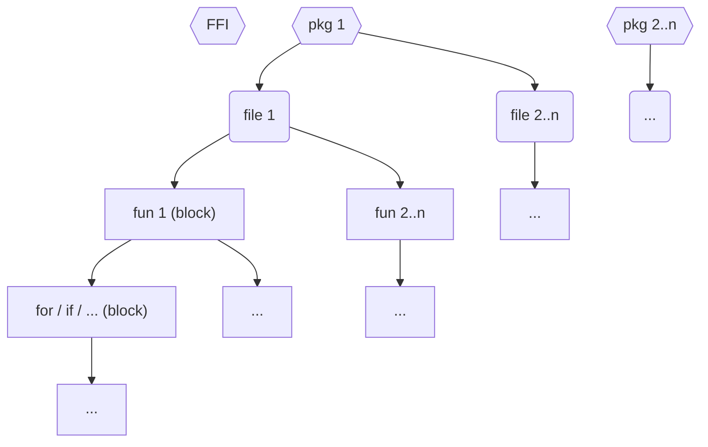

# Compiler Design
How are internal core systems of the compiler designed and currently implemented?

See also the [compiler structure](../development/structure.md#compiler-structure).


## Scope System
Identifiers are bound to and only accessible in a specific context called _scope_.

### Hierarchy


### Scopes
#### Foreign Functions Interface (FFI)
- **Purpose:** Store all C / JS declarations depending on the used backend
- **Storage:**
  - `table.Table.scopes["LANG.foreign_pkg"]`
  - ScopeObject
    ```bait
    pkg = "foreign_pkg"
    is_pub = true
    ```
- **Contents:** consts

#### Package Scopes
- **Purpose:** Store toplevel declarations and their visibility
- **Storage:** `table.Table.scopes["full.pkg"]`
- **Contents:** globals, consts

#### Block Scopes
- **Purpose:** Store local symbols
- **Contents:** _TODO_


### References
- [GH-246](https://github.com/bait-lang/bait/issues/246)
