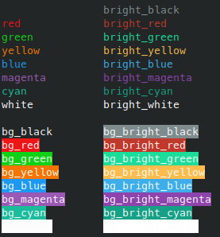
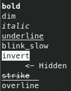
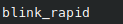

# term.color
ANSI colors and text formatting.

> You can run `bait run readme_showcase.bt` to see the following showcase in your own terminal.

## Standard Colors (3- and 4-bit)

## Formatting

## Formats likely to be unsupported

